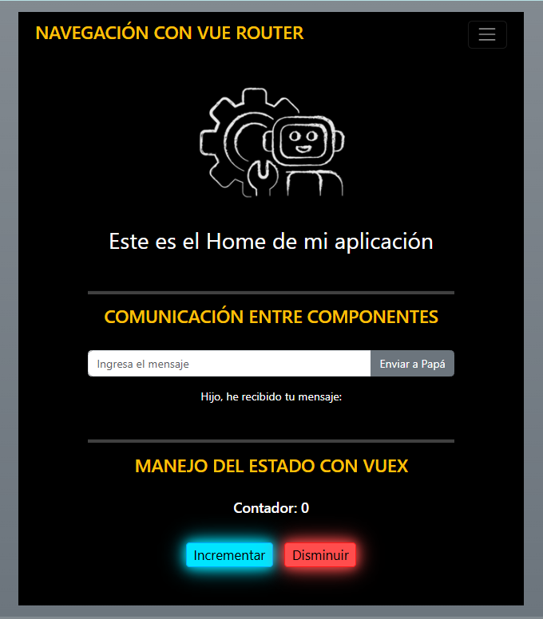

# **FRONT-END APPLICATIONS + UNIT TESTS** [](https://github.com/YADICEP)
It consists of 3 different applications: one for practicing state management with Vuex through a counter, another for practicing navigation with Vue Router across multiple views, and finally, one for practicing communication between components. Unit tests are also run to verify the functionality of each application.

Check out the application here 👉🏼 https://pruebam7-af3a1.web.app/


## **Technologies Used**
- **Vue.js**
- **Vue Router**
- **Vite**
- **Vuex**
- **Firebase**
- **Jest**
- **JavaScript**
- **Bootstrap**
- **HTML5**
- **CSS3**

## **Features**
1. State Management with Vuex:
   - A counter that can increment and decrement its value.  
   - The counter starting at 0.  
   - Unit tests to:  
     - Verify the initial value is received.  
     - Test the increment and decrement functionality.  

2. Navigation with Vue Router:
   - Default views created during the Vue Router installation.  
   - Validation of the existence of components controlling the views through unit tests.  

3. Communication Between Components:
   - Two components: `Parent.vue` and `Child.vue`.  
   - In `Child.vue`:  
     - A text input field and a button.  
     - The entered text sent to the `Parent` component when the button is clicked.  
   - In `Parent.vue`:  
     - Display of the text received from the `Child` component.  
   - Unit tests to validate that the text is correctly sent from `Child` when the button is clicked.  

4. Build Generation and Deployment:
   - The production build of the application.  
   - Deployment of the build to Firebase Hosting.  

## **Screenshots**
<p align="center">
  
</p>


## Clone the repository
```bash
   git clone https://github.com/yadicep/vue_applicactions.git
```

## Project setup
```
npm install
```

### Compiles and hot-reloads for development
```
npm run serve
```

### Compiles and minifies for production
```
npm run build
```

### Run your unit tests
```
npm run test:unit
```

### Deploy the application
```
firebase deploy
```

### Run tests
```
npm run test:unit
```

---

### Customize configuration
See [Configuration Reference](https://cli.vuejs.org/config/)


